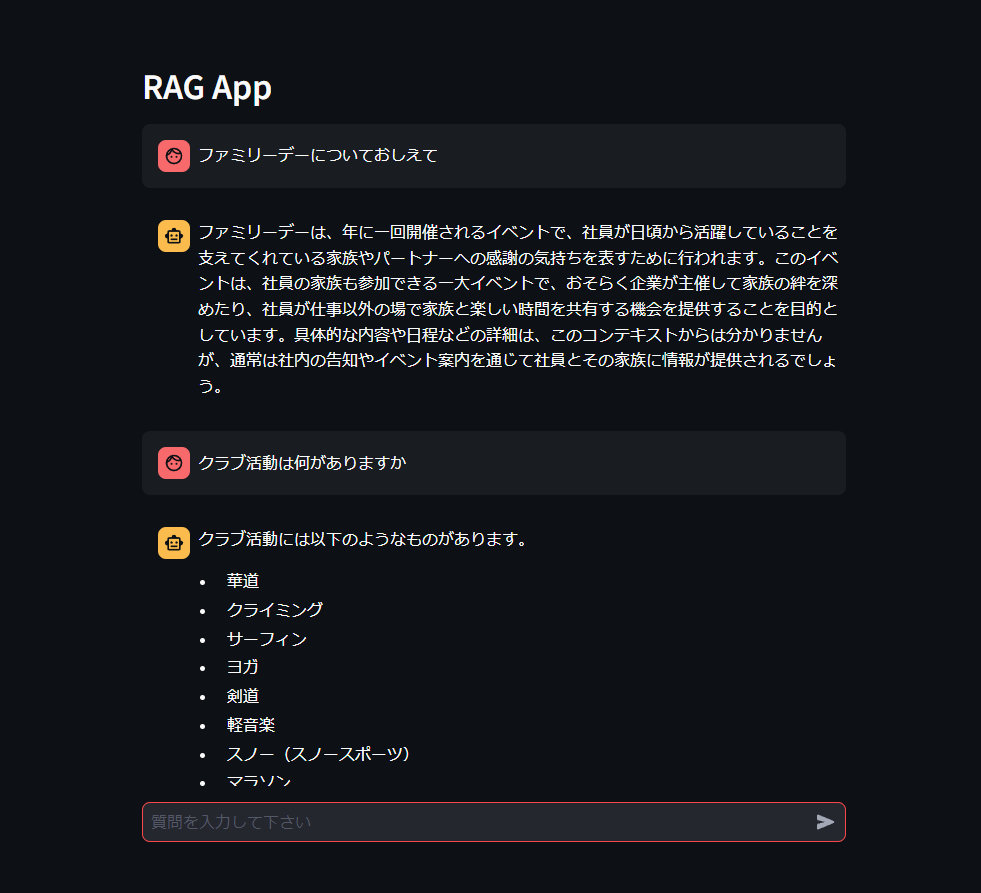

# Streamlit RAG Chatbot

## Overview
This is a web application that implements a question-answering system using the Retrieval-Augmented Generation (RAG) model. It combines GPT models with information retrieval techniques to generate appropriate responses to user queries.

## Environment Setup

Create a container from VSCode's Dev Containers.

## Setup Instructions

1. Use the `.env.sample` file as a reference to create a `.env` file and set your OpenAI API key.

2. Change the URL in the `process_webpage(url)` function in `retrievers.py`.

3. Run `python retrievers.py` to create indexes in the `faiss_store` directory.

4. Execute the following command to start the application:
   ```
   streamlit run app.py
   ```

## How to Use

* After launching the application, enter a question on the web interface.
* The RAG model generates a response to your question and displays it on the interface.


